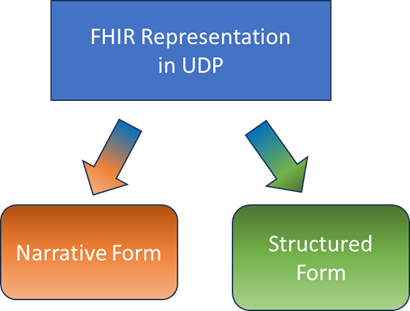
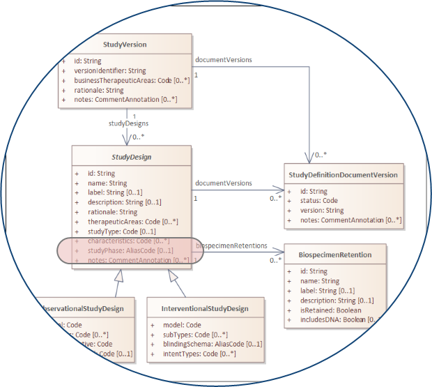
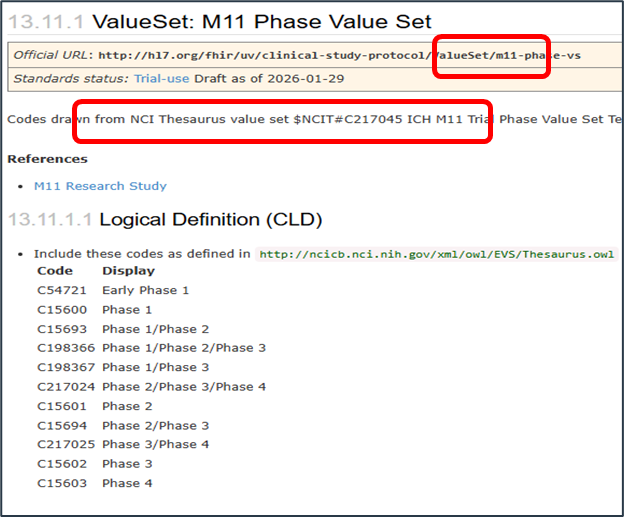

The major FHIR elements used are discussed first followed by explanation of the mappings between M11, USDM and FHIR.

### FHIR Elements and Protocol Representation

We assume a basic understanding of FHIR - to get an introduction, see the section on [Introduction to FHIR](links.html#introduction-to-fhir) in the links section of this IG.

The elements of FHIR we will refer to are as follows:

**Resource** - the basic building block defined by the FHIR specification that represents a concept and its key attributes.  For our present purposes the key is the **ResearchStudy** resource.

**Datatype** - each attribute within a resource has a specific data type.  In addition to the usual string, integer etc FHIR also defines complex data types for concepts such as Address, Signature and many more.  Of particular relevance is the Code and the CodeableConcept

**Terminology** - Many items are represented by a fixed *Code* which represents a specific concept.  The human readable representation of the concept is the *Term* and a code may have multiple different terms to meet conventional wording in a given context but all the terms have the same meaning (concept).  Codes can be arranged in a hierarchy and this constitutes a *CodeSystem*. To express meaning we have to know both the Code and the CodeSystem and for human readability we often include the preferred Term.  The Code and the CodeableConcept contain attributes for all three of these elements.  To determine which codes are allowed for an attribute we specify a *ValueSet* which explicitly or implicitly specifies the codes that are allowed.  The codes may come from more than one code system. In addition to binding a ValueSet to an attribute we also specify if that ValueSet is the only one that can be used (*Required* Binding), codes must be used if they cover the concept but new codes can be added for concepts not in the value set (*Extensible* binding) or the value set is optional (*Preferred* and *Example* bindings).

**Extensions** - FHIR does not attempt to cover all minority concepts but restricts itself to those that are widely used and then provides a mechanism for defining extensions to a resource in a way that existing FHIR servers can handle even though they may never have seen the extension before.  To represent the entirety of USDM and M11 concepts we make significant use of extensions.

**Profiles** - Resources that are defined by the FHIR specification generally have a lot of flexibility in them.  For instance: 

- attributes may occur zero to many times, 
- value sets have an Example binding, 
- references from one resource to another allow as wide a set of options as possible.  

Profiles are about reducing these options to what is relevant for a particular use case. Attributes that were optional can be made mandatory, allowable codes can be restricted to a small set and so on.  Extensions can also be subject to profiling.

The relationship between these components is simplistically shown in the diagram below.

<div>
<p>Figure 1: Simple representation of FHIR components</p></div>

#### Protocol Content - Narrative vs Structured   

ICH M11 provides a globally harmonized standard set of protocol content and organization of that content through the headings and common text in [M11 Template](https://hl7.org/fhir/uv/pharmaceutical-research-protocol/2025Sep/Mappings/ICH_M11_Technical%20Specification_Updated%20Step%202_2025_0203.docx) and [M11 Guideline](https://hl7.org/fhir/uv/pharmaceutical-research-protocol/2025Sep/Mappings/ICH_M11_Technical%20Specification_Updated%20Step%202_2025_0203.docx). The [M11 Technical Specification](https://hl7.org/fhir/uv/pharmaceutical-research-protocol/2025Sep/Mappings/ICH_M11_Technical%20Specification_Updated%20Step%202_2025_0203.docx) also provides a bases for digital data exchange by specifying a set of data fields and terminologies to be included in the technical representation of protocols which can be exchanged through various standards. This Implementation Guide specifies how to leverage FHIR for exchange of protocols according to the ICH M11 specifications. 

The implementers will vary in their desired use of M11: some will treat as a document, others will leverage structured content, others will utilize for machine processing

The FHIR implementation must therefore cover both narrative and structured content. The challenge is that some data is purely textual while others is quite granular.  We also have to recognize that some implementers will cling to a document paradigm while others will want to use the granular machine readable content as they automate systems.

<div>
<p>Figure 1: FHIR must support both Narrative and Structured representation</p></div>


##### Narrative Representation

In FHIR representation of "documents" is done using a *Composition* resource.  This is not immediately accessible from the ResearchStudy resource and so we create an extension called [NarrativeElements](StructureDefinition-narrative-elements.html) to allow ResearchStudy to point to Composition. 


<div>
<p>Figure 2: Narrative Elements</p></div>


To properly reflect the M11 template, the sections and sub-sections in the **Composition** need to match those in the protocol template. 

The template sections can be defined in terminology – a part of the terminology is shown in the diagram below.

<div>
<p>Figure 3: A part of the Section Code List</p></div>

Specific narrative instances can then use the codes to specify which parts of the M11 Template they represent.

<div>
    <p>Figure 4: Narrative Content Example</p></div>
In the illustration above **ResearchStudy** has two **NarrativeContent** sections attached. One with code *C218517* which is *1.1.2 Overall Design* and one with code *C218520* which is *2 INTRODUCTION* and this would then have all the sub-sections within the *INTRODUCTION*.

###### Composition Examples

This structure allows flexibility in the way compositions are used. It is possible to use a single composition and put all the narrative content into that; at the other extrememe it is possible to put every narrative section into its own composition. The expectation is that use of a single composition will be appropriate for document centric use cases but for other use cases where the focus is on more granular data a balance can be found between the number of distinct compositions and the overhead of having multiple compositions.

In the examples provided [Composition-IGBJ-Narrative.html](Composition-IGBJ-Narrative.html) shows combination of two sections (*1.3 Schedule of Activities* and *5.1 Description of Trial Population and Rationale*) into one composition while [Composition-IGBJ-Narrative-2.1.html](Composition-IGBJ-Narrative-2.1.html) and [Composition-IGBJ-Narrative-9.html](Composition-IGBJ-Narrative-9.html) show separate compositions for section *2.1 Purpose of Trial* and section *9 ADVERSE EVENTS, SERIOUS ADVERSE EVENTS, PRODUCT COMPLAINTS, PREGNANCY AND POSTPARTUM INFORMATION* respectively. These compositions are all referred to from the full example [ResearchStudy-IGBJ-ResearchStudy.html ](ResearchStudy-IGBJ-ResearchStudy.html) 

##### Structured Representation

The real power of a digital protocol comes from representing the content as a series of distinct attributes. USDM and M11 provide information models that can be represented by FHIR using the same resources used for the narrative representation.  While many of the necessary attributes are already present there are inevitably some that have no FHIR equivalent.  For this we use the extension mechanism.

<div>
<p>Figure 4: Structured Content</p></div>

Some of these extensions are general purpose and will be relevant beyond USDM and M11 and they can be profiled to tie them to exact requirements.

##### Hierarchy of Resources, Extensions and Profiles Used

The drawing below shows the names of the Profiles used and the Extensions made for UDP. For description of the function of profiles and extensions see the [description above](fhir-representation.html#fhir-elements-and-protocol-representation)

<div>
<p>Figure 5: Profiles of ResearchStudy and Composition and associated Extensions</p></div>

The list below shows the hierarchy, of profiles, extensions and their attributes (the [artifact definitions](artifacts.html#structures-resource-profiles) should be consulted for the full details)

> - p) m11-research-study-profile(ResearchStudy)
>   - (e) narrative-elements named narrative
>     - value
>     - (p) m11-research-study-narratives(composition)
>       - subject
>       - section
>       - type
>       - author
>   - (e) M11_ProtocolAmendment named amendment
>     - scope
>     - country
>     - region
>     - site
>     - approvalDate
>     - signature
>     - signatureUrl
>     - signatureMethod
>     - (e) ResearchStudyStudyAmendmentScopeImpact named scopeImpact
>       - number
>       - scope
>     - primaryReason
>     - secondaryReason
>     - summary
>     - substantialImpactSafety
>     - substantialImpactSafetyComment
>     - substantialImpactReliability
>     - substantialImpactReliabilityComment
>     - (e) ResearchStudyStudyAmendmentDetails
>       - detail
>       - rationale
>       - section
>     - rationale
>     - description
>   - (e) ResearchStudySponsorConfidentialityStatement named confidentialityStatement
>     - value

### Terminology

The basics of terminology principles are discussed above.

The Value Sets used in this IG are listed on the Artifacts page, in almost every case the value set is composed of terms from the NCI Thesaurus and have been collated by CDISC for ICH and also form part of the USDM work.  The values reflect those presented by ICH in the Technical Specification.  The exceptions to this are the ISO Country codes and a reference to the one Code System defined here which is for managing the Narrative Element structure.

The following series of diagrams explains how the different models all use a common terminology sourec.

In USDM Phase is represented by the studyPhase attribute of the StudyDesign class.  

<div><p><a href="../images/image-20260129155349453.png">  </a> <p>
    Figure 1 : USDM for Phase"
    </p></p></div>

In M11 Phase is represented by TrialPhase attribute in the Template and Technical Specification 

<div><p><a href="../images/image-20260129155431823.png">  </a> <p>
    Figure 2 : M11 for "Phase"
    </p></p></div>


These values are all held in the NCI Thesaurus and the concepts are in an NCI code set with code C217045

<div><p><a href="../images/image-20260129165903655.png">  </a> <p>
    Figure 3 : NCI Code Set for "Phase"
    </p></p></div>

In the UDP IG this code set is represented by a value set with the identifier m11-phase-vs and the expansion of the value set is derived from the NCI content (*the NCI content is the master, the FHIR value set is not detached from the NCI source*). 

<div><p><a href="../images/image-20260129165955355.png">  </a> <p>
    Figure 4 : UDP Value Set for "Phase"
    </p></p></div>

The phase attribute in FHIR is then bound to this value set.

<div><p><a href="../images/image-20260129170010341.png">  </a> <p>
    Figure 5 : UDP attribute for "Phase" bound to value set
    </p></p></div>

### Validation

A benefit of FHIR that may not be immediately obvious is that all of the technical content of an FHIR Implementation Guide can be used by a FHIR server to validate content submitted to that server which should comply with the IG.   This goes beyond the validation possible for regular JSON or XML content because the IG level validation will only be applied to inputs that say they comply with the IG.  This allows a regular FHIR server to perform very targeted validation of incoming content and reject invalid input.

To achieve this level of validation use the Artifact definitions in the Downloads section of this IG and load that content to your server.  Your server will have instructions on how to do this.


### USDM and M11 to FHIR Mapping

There haas to be a mapping from M11 to FHIR and also one from USDM to FHIR. The relationships between the elements of M11, USDM and FHIR are shown in the Mapping spreadsheet described in the following section.  The focus of this is representation of M11 so the mapping does not cover the whole of USDM at this time.  There is a useful infographic from CDISC here: [usdm_m11_classes.pdf](Mappings\usdm_m11_classes.pdf) that shows the overlap between M11 and USDM and in the bottom right USDM classes not covered by M11.

The USDM to M11 mapping is provided by CDISC. There is then a consequence that the USDM to FHIR mapping may be forced to a particular form by the M11 to FHIR mapping that would not be the case if it was just a USDM to FHIR mapping. The mapping to FHIR is then a mapping from USDM to FHIR and M11 to FHIR since the two must be consistent. It is two mappings in the one document. 

The spreadsheet for mapping to FHIR is in 3 parts as shown  in the illustration. Click on the illustration or click <a href="Mappings/M11 to FHIR Mapping 01.xlsx">here</a> to download the full spreadsheet

<div><p><a href="Mappings/M11 to FHIR Mapping 01.xlsx">  </a> <p>
    Figure 6 : M11 / USDM / FHIR Mapping Spreadsheet
    </p></p></div>

The FHIR columns of the spreadsheet are described in detail below together with examples.

|     FHIR Column     | Purpose                                                      |
| :-----------------: | ------------------------------------------------------------ |
|      Resource       | A simple path  to the relevant FHIR resource                 |
|     Sample XML      | A fragment of XML that illustrates  the mapping. Uses parameters starting  with a $ or % for conciseness |
|  Example  Value(s)  | Elements beginning with % are given  a value here - above the dashed line they are fixed, below they are whatever  the actual data is. Also uses macro  values beginning with $ |
| Binding  (strength) | FHIR terminology must be bound to a  value set and the strength determines whether the value set is fixed or can  be extended. |

*Narrative Content is noted in the mapping sheet but is shown on a separate tab of the spreadsheet.  It is discussed further below.*

#### Resource Column

This is the element in FHIR that maps to the M11 element.  In many cases there is a simple equivalent in the standard FHIR resource. 

| M11         | FHIR Resource       |
| ----------- | ------------------- |
| Trial Phase | ResearchStudy.phase |

In other cases there is no immediate equivalent and a FHIR extension has to be used.  In the example below the extension is a complex one. Extensions are indicated by the word extension followed by the extension name in square brackets. The extension is called `$ext-amd` and within that the extension element is called `scope`.  

| M11             | FHIR Resource                                      |
| --------------- | -------------------------------------------------- |
| Amendment Scope | ResearchStudy.extension[$ext-amd].extension[scope] |

The other pattern found is when the ResearchStudy resource points to an instance of another resource for the necessary link.  In the example below Sponsor Name is represented in FHIR using an Organization resource which is pointed to by ResearchStudy using the associatedParty element.  The reference from one resource to another is shown using `-->`

| M11           | FHIR Resource                                                |
| ------------- | ------------------------------------------------------------ |
| Sponsor  Name | ResearchStudy.associatedParty.party.reference  -->     Organization.name.value |

> "FHIR Path" is a specific machine processable representation path through a linked series of FHIR resources.  That is NOT what is being used here.


#### Sample XML and Example  Value(s) Columns

For each row the structure is shown in XML.  XML has been used in preference to JSON because the XML can be validated with a schema.  

ResearchStudy.phase is a coded value in FHIR and uses the CodeableConcept data type which itself has multiple elements.  Some of these elements have value that is fixed by the mapping and some are the values for the specific instance.  The fixed and variable values are indicated by prefixing the name with a %.  The actual values are then shown in the Example Values column - fixed values above the dashed line, variable ones below.  Because fixed values occur repeatedly and are often lengthy URLs they are represented by a macro element indicated by the $ prefix.  In the example below $NCIT has an actual value of http://ncicb.nci.nih.gov/xml/owl/EVS/Thesaurus.owl. 

###### Trial Phase

```xml
<phase>       
    <coding>         
        <system value=  %SYSTEM />         
        <code value= %CODE />         
        <display value= %DISPLAY  />       
    </coding>     
</phase> 
```

```
%SYSTEM = $NCIT
------------------
%CODE = <C15602>
%DISPLAY = <Phase 3>
```

###### Amendment Scope

```xml
<extension url= $ext-amd>
    <extension url="scope">
        <valueCode value= %VALUE />
    </extension>
</extension>
```

```
%VALUE = <C217026>
```

###### Sponsor  Name

```xml
<associatedParty>
    <role>
        <coding>
            <system value= %SYSTEM />
            <code value= %CODE />
            <display value= %DISPLAY />
        </coding>
    </role>
    <party>
        <reference value="Organization/%ID" />
    </party>
</associatedParty>

<Organization>
    <id value= %ID />
    ... 
    <name value= %VALUE />
    ...
</Organization>

```

XML for Organization is not shown in full - there will be address, contact details etc which are indicated above by ...

```

%SYSTEM = $NCIT
%CODE = C70793
%DISPLAY = Clinical Study Sponsor
----------------
%ID = <org-EliLilly>
%VALUE = <Eli Lilly Japan K.K>
```

#### Binding and Binding Strength Columns

It happens that the three examples shown here all make use of coded elements but this is not always the case.  Binding only applies for coded elements.

For a coded element FHIR requires the specification to state the Value Set of allowed codes.  This is important for validation and for ensuring that coded elements conform to a set of values that all will understand.  A Value Set can be an arbitrary list of codes (and the identity of the code system they belong to), or the Value Set may specify an entire code system (perhaps with some codes excluded).

The FHIR specification will identify a Value Set of each coded element - this is referred to as the *Value Set Binding* and these bindings can vary in the extent to which they must be enforced - this is the *Binding Strength*.  Generally a binding on a core FHIR specification can be interpreted quite flexibly and as that core specification is restricted by an Implementation Guide it will become much more rigorously specified.  There are 4 Binding Strengths

| Binding Strength | Meaning                                                      |
| ---------------- | ------------------------------------------------------------ |
| Example          | This value set is for illustration only.  It may be useable in practice but no particular effort has been made to ensure that this is so.. |
| Preferred        | The bound Value Set is fit for purpose but there may be other equivalent value sets more commonly used in a given context, or there may be different contexts that require a different value set. |
| Extensible       | The bound value set has a values that MUST be used for the specific concept they represent - however if other concepts are required a new value set can be created that contains the previously bound value set plus the additional concepts. |
| Required         | The Value Set bound to the element is the one that MUST be used.  It cannot be replaced, extended or modified. |

As the table above shows the base FHIR specification will generally provide bindings of Example or Preferred strength while an Implementation Guide should provide bindings that are Extensible or Required.  Generally if the Value Set refers to a concept that has a limited number of possible values and where adding a value is likely to result in an update to the processing logic (ie a software update)  it should be a Required binding.  Where an Extensible binding is used processing system should be able to cope with addition of a value - perhaps through an exception mechanism.

The bindings and binding strengths for the examples above are shown below. 

###### Trial Phase

```
$phase-vs (extensible)
```

###### Amendment Scope

```
m11-study-amendment-scope-vs (required)

```

###### Sponsor  Name

```
$study-role-vs (extensible)
```

#### Narrative Content

There are multiple sections that can be represented by Narrative content as discussed earlier.  Since these all follow the same pattern the example XML for the Composition part is shown here:

```xml
<composition>
    ...
    <type>
        <coding>
            <system
                    value="http://hl7.org/fhir/uv/pharmaceutical-research-protocol/CodeSystem/narrative-elements-cs"/>
            <code value="b001"/>
            <display value="Protocol narrative"/>
        </coding>
    </type>
     ...
    <section>
        <title value=%DISPLAY/>
        <code>
            <coding>
                <system value=$NCIT/>
                <code value=%CODE/>
            </coding>
        </code>
        <text>
            <status value="additional"/>
            <div xmlns="http://www.w3.org/1999/xhtml">%NARRATIVE</div>
        </text>
    </section>
    ...
</composition>
```

The example values here are 

```
%CODE = <C218514>
%DISPLAY = <1 PROTOCOL SUMMARY>
--------------------------------
%ID= <iiii>
%NARRATIVE = <nnnn>
```

