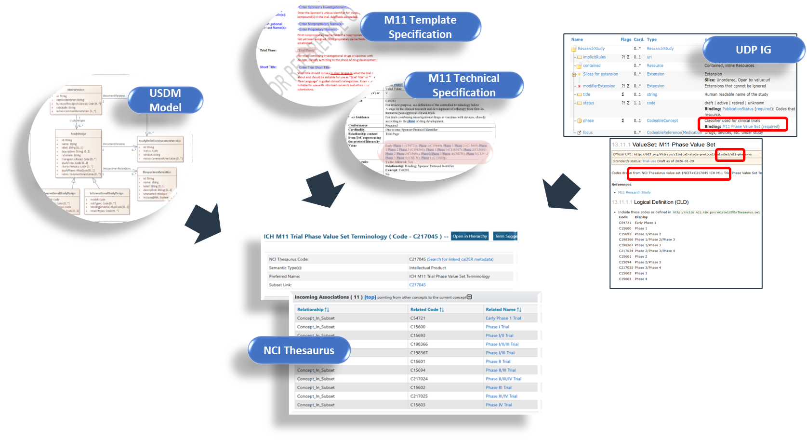

### Information Models

**Primary Inputs into this Implementation Guide**

There are multiple original sets of work that have been brought together to develop this Implementation Guide and set the vision for future versions.   

 

**ICH M11 CeSHarP** – is establishing a standardized framework for protocols, ensuring information is consistently presented using the same headings and sequence within the document. This familiar structure promotes efficient review and reduces the risk of significant elements being overlooked. While the document may be in paper format, it is expected to be machine-readable, preventing information from being "trapped" and requiring manual reentry. ICH aims to have one of these machine-readable formats be FHIR-based, which is the genesis of this Implementation Guide . The primary use case ICH is concerned with is the transfer of a protocol from a sponsor to a regulator if and when FHIR is required. 

**CDISC USDM** – USDM is an output of the Digital Data Flow (DDF) initiative, a collaboration between CDISC and TransCelerate aiming to modernize clinical trials by transitioning from a document-centric to a data-centric approach, focusing on digitizing protocols to enable automation, interoperability, and reuse across the study lifecycle. One of the critical outputs is the CDISC Unified Study Definitions Model (USDM), an information model aligned to ICH M11 and other industry standards. USDM defines highly granular data elements which are the building blocks required to achieve a wide range of use cases such as specify a study design, enable reuse and automation of study design information in downstream systems and processes for conduct, reporting and analysis of studies. Through use of the USDM, as well as other outputs (i.e., a reference Study Definitions Repository and related APIs), DDF seeks to reduce cycle times, improve data reliability and quality, and eliminate non-value-added activities through automation. This digital workflow supports automated study asset creation and system configuration, ultimately transforming the drug development process.

Through CDISC collaboration with ICH M11, it has been established that CDISC will support the maintenance and governance of ICH M11 controlled terminology. In addition, USDM has been built such that **ICH M11 elements are a subset of the USDM**. In other words, those who adopt USDM will have adopted ICH M11 data elements. Stakeholders depending on their use cases of interest can elect to adopt only ICH M11 elements or they can adopt the full USDM. Vulcan UDP has leveraged the ICH M11 elements via leveraging the ICH M11 subset of USDM, and then enabled the exchange of this information via FHIR. 

Since USDM was first introduced there has been significant progress in adoption of it, primarily for sponsor-oriented use cases. Collaboration with Vulcan UDP and ICH M11 aims to accelerate the implementation and thereby bring additional value to various stakeholders. 

> **NOTE:** The relationship between the M11 protocol template specification and the structured and unstructured capabilities of the USDM is illustrated on the DDF GitHub site. Each logical area of the M11 protocol template is highlighted along with the associated area within the USDM. See infographic  [usdm_m11.pdf](https://github.com/data4knowledge/usdm_m11_resources/blob/main/documents/infographics/usdm_m11.pdf) 

More detailed background and links to source material for each of these projects can be found in the [Links section](links.html).

To understand how these artifacts relate to, and can be compatible with, each other, consider that standards can have different purposes. 

In one very simplistic view:

- Exchange Standards are containers to move information from one system to another. For example, FHIR is used to exchange health data across multiple systems. 
- Content Standards are those which specify how structured the information needs to be, how it should be referred to, and how the pieces of information relate to each other.  For example, the ICH M11 technical specification details which protocol content     needs to be structured (as opposed to narrative text). As another example USDM specifies the structured items detailed by M11 as well as specifying structure for additional content. 
- Terminology Standards specify semantic definitions and the possible values of structured items. For example, ICH M11 and USDM both specify terms centrally managed by CDISC. 

These are not distinctions that have clear boundaries between them but they help us classify the purpose of organising data in particular ways.  If we consider the distinction as being functional then we can also think about the tools and techniques available for that function that make processes more reliable and repeatable.

For an exchange standard the focus is to enable reliable communication between senders and receivers who may have different levels of technical sophistication and perhaps different business objectives and priorities.  FHIR addresses this by having a limited set of data components into which all the information to be transmitted must fit.  This means that software handling the transfer has a limited and standard set of components to work with and in turn this means that techniques for data integrity checks, error handling and transmission speed can be standardised rather than being custom made.

In contrast a Content Standard has to represent the domain of interest (its subject matter) with a precision that means the components are all custom made.  While there may be some common components to represent simple types of data (strings, integers etc) the attributes of a each component are likely to be peculiar to that component.

These two work together because the exchange standard is capable of treating each component of the content model as a black box and reliably communicating that black box from sender to receiver.

USDM is a content model that is particularly detailed as it aims to represent all the elements of a study in a machine readable way by specifying all the potential parameters or data elements of a study.

The ICH M11 model is also a content model but less detailed than USDM because for the majority of the protocol it simply tries to specify which section each type of information must be placed.  In most cases it assumes this information will still be a block of text.

Another way to visualise the distinction between an exchange model and a content model is to think of a shipping container.  The containerisation of goods allows ports and road transport to develop specialised systems to handle the shipping container with no knowledge of the good contained within.  The shipping container is the exchange model, the goods within are described by the content model. 

While these models have different purposes and hence different structures they still operate through a common terminology.  The diagram below illustrates the NCI thesaurus as a common source.  For a more detailed treatment of this see the terminology discussion [here](fhir-representation.html#terminology).

 

    Figure 1 : All three models drawing from the same terminology source (the NCI Thesaurus) for their set of available values for "Phase"
    

